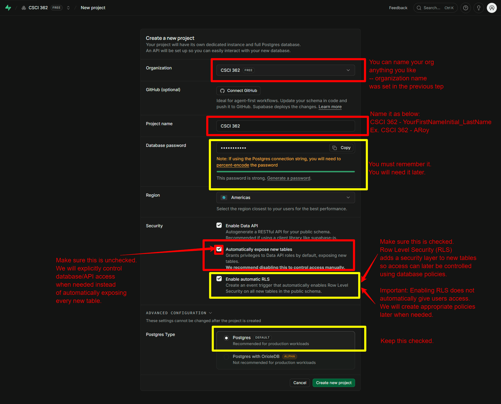

# CSCI 362 — SQL Lab Readiness Guide

## Set Up Your Supabase PostgreSQL Project

CSCI 362 uses **PostgreSQL** for hands-on SQL work. Supabase provides a browser-accessible PostgreSQL database and a SQL Editor that we will use during demonstrations, exercises, labs, and database-project work.

Complete this setup **before the deadline posted on Brightspace**. This is a readiness task only: create the account and project, verify that the dashboard opens, and then stop. We will create database objects together when instructed.

> [!IMPORTANT]
> **Do not create tables, schemas, policies, sample data, or other database objects yet.** Do not run a tutorial against this project. Your dashboard will contain Supabase-managed system objects; leave them unchanged.

## What You Need

- Your John Jay College email account
- A secure place to store one database password
- A modern web browser
- Approximately 10–15 minutes
- No paid subscription or credit card

## Completion Checklist

You are ready for the SQL lab when all of the following are true:

- [ ] You can sign in to Supabase.
- [ ] Your project name follows the required course convention.
- [ ] The project uses the **Free** plan.
- [ ] The region and security settings match this guide.
- [ ] The project dashboard opens and the project is ready.
- [ ] Your database password is stored securely.
- [ ] You have not created or changed database objects.

## 1. Create or Sign In to Your Supabase Account

Open [Supabase](https://supabase.com/) and create an account or sign in.

We recommend using your official John Jay College email address because it is less likely to be associated with an existing Supabase account or active projects. You may use another personal email address if necessary. Whichever address you choose, record it and use the same Supabase account for all CSCI 362 labs. Complete any email-verification step before continuing.

If Supabase offers an optional GitHub connection or integration, leave it disconnected. GitHub integration is not required for this setup, and Brightspace remains the official course hub.

## 2. Open the Dashboard and Start a Project

After you verify your account, Supabase may automatically prompt you to create your first project. If that prompt appears, select **Create a project** or **New project** and continue to Step 3.

If Supabase does not display a project-creation prompt, open the [Supabase Dashboard](https://supabase.com/dashboard) and select **New project**.

A Supabase project includes its own PostgreSQL database. If the interface asks you to choose a plan, select the **Free** plan. Do not upgrade or enter payment information for this course setup.

> [!NOTE]
> Supabase currently limits how many active Free Plan projects one account can own. If the dashboard says that you have reached your limit, do not delete a project you still need and do not purchase a plan. Contact the instructor for guidance.

## 3. Choose an Organization

Every Supabase project belongs to an organization. If you need to create one, use this recommended name:

```text
CSCI 362
```

If you already have a suitable personal organization, you may use it. The organization name does not have to match the project name.

## 4. Name the Project

Use this exact naming pattern:

```text
CSCI 362 - FirstInitialLastName
```

Replace `FirstInitialLastName` with your first-name initial followed by your full last name, with no space or underscore between them.

Examples:

```text
CSCI 362 - ARoy
CSCI 362 - JSmith
CSCI 362 - MGarcia
```

Do not use a generic name such as `My Project`, `Test`, `Database Project`, or `Project 1`.

## 5. Create and Store the Database Password

Supabase will ask you to create or generate a database password. Use a strong, unique password and save it in a password manager or another secure location that you can access later.

This is a database credential. You will need it when we connect database tools or use a PostgreSQL connection string.

Never:

- submit the password on Brightspace;
- include it in a screenshot;
- send it by email or chat;
- share it with a classmate;
- place it in a document or notebook; or
- commit it to GitHub or any public repository.

## 6. Select the Region

For **Region**, select:

```text
Americas
```

If Supabase displays individual regions instead of the general `Americas` option, choose a U.S. region close to New York. Do not move an existing project or create another project solely because the displayed region name later looks different.

## 7. Configure the Security Settings

Use the following settings when creating the project:

| Setting | Required selection |
| --- | --- |
| **Enable Data API** | On / checked |
| **Automatically expose new tables** | **Off / unchecked** |
| **Enable automatic RLS** | On / checked |
| **Postgres type** | Standard/default Postgres |

The wording or order may change slightly as Supabase updates its dashboard. If you cannot identify an equivalent setting, stop and ask rather than guessing.

### Enable Data API — On

Leave **Enable Data API** turned on. We will use PostgreSQL directly for the initial SQL labs, but the Data API may support later demonstrations.

### Automatically Expose New Tables — Off

Turn **Automatically expose new tables** off. New tables should not become accessible through the Data API merely because they were created.

This setting does not prevent normal work in the SQL Editor. It controls default API privileges for newly created objects in the `public` schema.

### Enable Automatic RLS — On

Leave **Enable automatic RLS** turned on. Row Level Security (RLS) is a PostgreSQL security mechanism that can restrict which rows a role may access.

PostgreSQL privileges and RLS are separate security layers:

```text
Table privileges: Can the role access this table?
RLS policies:     Which rows may the role access?
```

You do not need to create grants or RLS policies during setup. We will address permissions and policies when they are part of the course work.

### Postgres Type — Default

Under any advanced configuration options, keep the standard/default **Postgres** choice. Do not select an experimental or preview database type unless the instructor specifically directs you to do so.

## 8. Review the Configuration

Before creating the project, check your entries against this summary:

```text
Plan:
Free

Organization:
CSCI 362 or an existing personal organization

Project name:
CSCI 362 - FirstInitialLastName

Region:
Americas or a nearby U.S. region

Enable Data API:
ON

Automatically expose new tables:
OFF

Enable automatic RLS:
ON

Postgres type:
Standard/default Postgres
```

### Project Setup Example

[](assets/images/sql-lab/project-setup.png)

**[Open the full-size project setup screenshot](assets/images/sql-lab/project-setup.png).** You can also select the preview above.

> [!WARNING]
> The screenshot captures the form before every required change was completed. Before creating your project:
>
> - replace the partial project name with your complete course project name, such as `CSCI 362 - ARoy`; and
> - click **Automatically expose new tables** so that its checkbox is **unchecked**.
>
> Confirm that **Enable Data API** and **Enable automatic RLS** remain checked.

Then select **Create new project**. Provisioning may take several minutes. Wait until the dashboard shows that the project is ready.

## 9. Verify Readiness and Stop

After provisioning finishes, confirm that you can:

1. Sign in to Supabase.
2. See the correctly named CSCI 362 project.
3. Open its dashboard without an error.
4. Retrieve your securely stored database password when needed.

Then stop. Do not independently:

- create, edit, or delete tables;
- create additional schemas;
- add sample data;
- run SQL copied from a tutorial;
- create grants or RLS policies;
- change database privileges;
- expose tables to the Data API;
- change authentication settings; or
- delete Supabase-managed system objects.

You do not need to know how to use the SQL Editor yet. We will use it together during the SQL lab.

## Before Each SQL Lab

Free Plan projects with low activity may be paused by Supabase. Before class:

1. Sign in to the [Supabase Dashboard](https://supabase.com/dashboard).
2. Open your CSCI 362 project.
3. If it is paused, select **Resume project** and wait for it to become ready.
4. Confirm that the project dashboard opens normally.
5. Bring the device and login method you plan to use in class.

Do not purchase a paid plan to prevent pausing. A paused Free Plan project can be resumed from the dashboard.

## Troubleshooting

### I. The project is still provisioning

Wait several minutes and refresh the dashboard. Do not create a second project while the first one is still being prepared.

### II. I reached the Free Plan project limit

Do not pay for an upgrade and do not delete a project containing work you need.

If you have not already used your John Jay email address for Supabase, you may create a new Supabase account with that address. This is the recommended option because your John Jay email is less likely to have existing Supabase projects. If necessary, you may instead use a different personal email address to create the course account.

Record which email address you used and keep using that account for CSCI 362. If neither option works, record the limit message and contact the instructor.

### III. My screen does not match this guide

Supabase may update its interface. Stop before confirming the project, take a screenshot that does not expose credentials, and ask the instructor which option to choose.

### IV. My project is paused

Open the project in the dashboard, select **Resume project**, and wait until the project reports that it is ready.

### V. I forgot or exposed my database password

Do not send the password to anyone. If you believe it was exposed, change or reset it through the project’s database settings before using the project, and update your password manager.

### VI. I need to report another error

Send the instructor:

```text
Your name
Course: CSCI 362
The setup step or troubleshooting reference where the problem occurred
The exact error message
A screenshot with all credentials and private information removed
```

For example, refer to `Step 7` or `Troubleshooting II` so the problem is easy to locate.

Never send your database password, API keys, connection string, access token, recovery code, or other credential.

## Official References

- [Supabase Database documentation](https://supabase.com/docs/guides/database/overview)
- [Supabase project regions](https://supabase.com/docs/guides/platform/regions)
- [Supabase Data API security](https://supabase.com/docs/guides/api/securing-your-api)
- [Supabase Row Level Security](https://supabase.com/docs/guides/database/postgres/row-level-security)
- [Supabase Free Plan project pausing](https://supabase.com/docs/guides/platform/free-project-pausing)

## Course Boundary

This guide prepares the technical environment only. Brightspace provides the official deadline, announcements, lab instructions, submission requirements, and any course-specific updates.

For definitions used during SQL labs, see the **[CSCI 362 SQL Vocabulary Guide](SQL-Vocabulary-Guide.md)**.

© Avijit Roy
